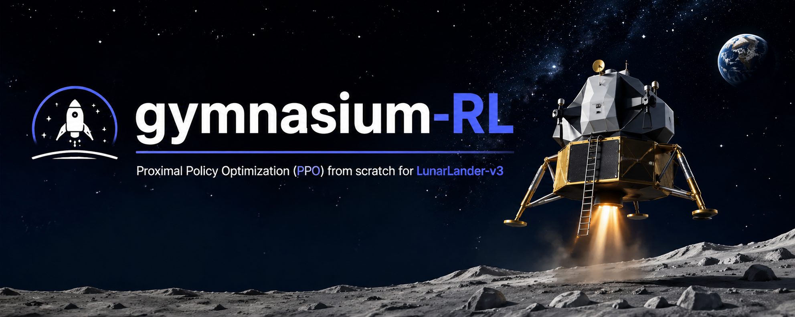
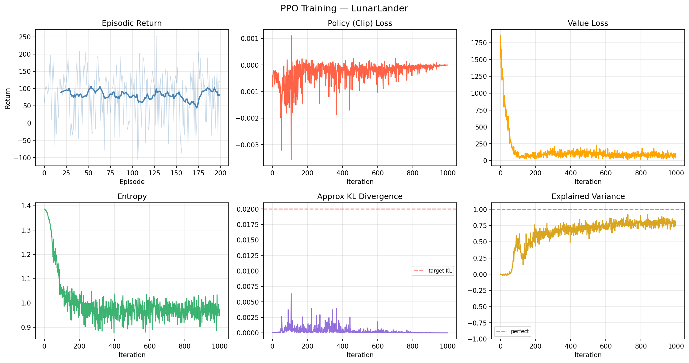

# Gymnasium-RL

 

This is my implementation of PPO to build a control policy for Lunar Lander on Gymnasium. My work is inspired by [cleanRL](https://github.com/vwxyzjn/cleanrl).

## My setup

All the libraries used are in the pyproject.toml. The project can be started quickly with uv. 
For the Lunar Lander, the observation space is a vector of $\mathbb{R}^8$. The action space is defined by the set $\{0,1,2,3\}$. The actor has to output a distribution from which an action will be sampled. The distribution is computed by getting the softmax of the logits of the actor.
The actor and the critic networks have two hidden layers of size 64 and one output layer. The activation function used is $tanh$ .
I spin 16 environments in parallel with a decaying learning rate.

## My findings

 
  
### Computation of the advantage

It can be showed that the advantage defines a sequence that can be computed backward. By letting $T$ the duration of an episode :

$$
\begin{aligned}
\hat{A_t} &= \sum_{k=0}^{T-t-1} ( \gamma  \lambda )^k \delta_{t+k} \\
				&= \delta_t +  ( \gamma  \lambda )  \sum_{k=1}^{T-t-1} ( \gamma  \lambda )^{k-1} \delta_{t+k} \\
				&=  \delta_t +  ( \gamma  \lambda )  \sum_{j=0}^{T-(t+1)-1} ( \gamma  \lambda )^{j} \delta_{t+1+j} \\
				&= \delta_t + ( \gamma  \lambda ) \hat{A}_{t+1}
\end{aligned}
$$

The last term $\hat{A}_{T-1}$ is computed easily. Either it is the end of an episode i.e. $V(s_T)=0$ or it is not and $V(s_T)$ is still tractable. It is the easiest way to compute as so.

### Entropy loss

The coefficient in front of the entropy loss makes a big difference. My entropy collapses really quickly and letting the coefficient goes from $0.01$ to $0.05$ really helped the policy to learn.

## My results

The policy managed to make the Lunar Lander lands for the first time around the 350th episode. The first video is the first try of the policy while the second is a try close to the end of the training.

https://github.com/user-attachments/assets/eb132a85-ec74-494d-a4f7-a1897a21067a

https://github.com/user-attachments/assets/52133184-3246-42f1-99ec-7e68702bdfc7

